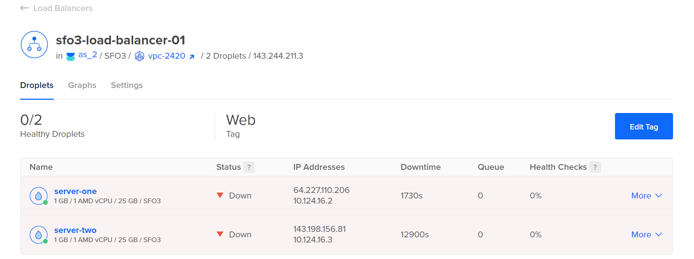

# ACIT 2420 Assignment 2

## Table of Contents

- [VPC Setup](#vpc-setup)
- [Creating Droplets](#creating-droplets)
- [Load Balancer Setup](#load-balancer-setup)
- [Firewall Setup](#firewall-setup)

## VPC Setup

1. On DigitalOcean, click on "Networking" then "VPC" then "Create VPC Network".

2. Set the preferred data centre.

3. Set the IP range to be generated by DigitalOcean.

4. Set the name of the VPC to something you can remember.

5. If the VPC was created successfully, you should be able to see the VPC under the "VPC" tab after clicking on "Networking".

## Creating Droplets

- Note: Before beginning, you will need to have a custom SSH key generated and added to DigitalOcean.

1. Create a new Droplet on DigitalOcean

- Note: All the settings will be set to default if not specified in the instructions below.

2. Set the VPC network to the VPC network you had just created.

3. CPU option can be set to anything. I will be using the cheapest option.

4. Set the SSH key a key that is added to DigitalOcean.

5. Set the number of droplets to 2.

6. Set the name of one droplet to "server-one".

7. Set the name of the other droplet to "server-two".

8. Add the tag "Web".

9. Click on "Create Droplet".

If done successfully, 2 droplets should have been generated with the tag "Web" and its names set to "server-one" and "server-two"

## Load Balancer Setup

1. Click on "Networking" then "Create Load Balancer" then "Create Load Balancer"

- Note: All the settings will be set to default if not specified in the instructions below.

2. Select the region that the droplets have been created in.

3. Change the VPC network to the VPC network that you had created in the VPC Setup instructions.

4. Under "Connect Droplets" type in "Web".

- **Note:** Once you have entered "Web", it should display that there is 2 droplets similar to the image below.

5. Under "Forwarding Rules", make sure that the settings match the image below.

6. The name of the load balancer can be set to anything. I will be keeping it as the default name.

7. Click on "Create Load Balancer".

If done successfully, you should be able to view the load balancer under "Load Balancers" in "Networking". Your screen should display something similar to the image below.

- Note: The status for both the load balancer and the droplets will be set to "down".

8. Verify that the droplets that you created are also displayed once clicking on the load balancer.

## Firewall Setup

1. Click on "Networking" then "Firewalls" then "Create Firewall".

- Note: All the settings will be set to default if not specified in the instructions below.

2. Set the name of the firewall to your preference.

3. Under "Inbound Rules", click on the dropdown for "New Rule" and select HTTP.

4. For the source of the new rule, add the load balancer that you had created. The settings for "Inboud Rules" should be similar to the image below.

5. Under "Apply to Droplets", add the tag "Web".

6. Click "Create Firewall"

7. Verify that the firewall now exists under "Firewalls" in "Networking".

8. Verify that the 2 droplets created previously are also under "Droplets" after clicking on the name of the firewall.

