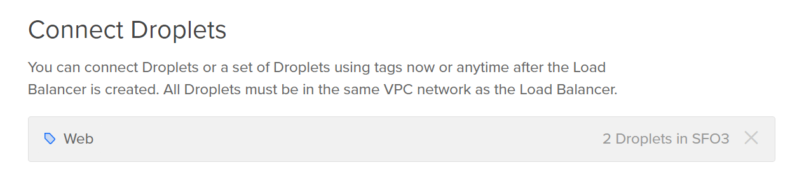
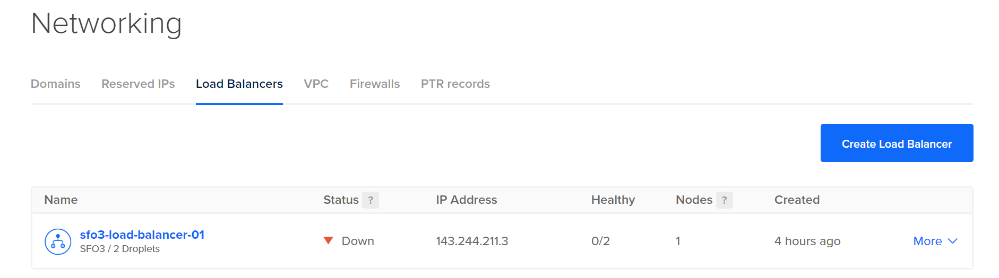
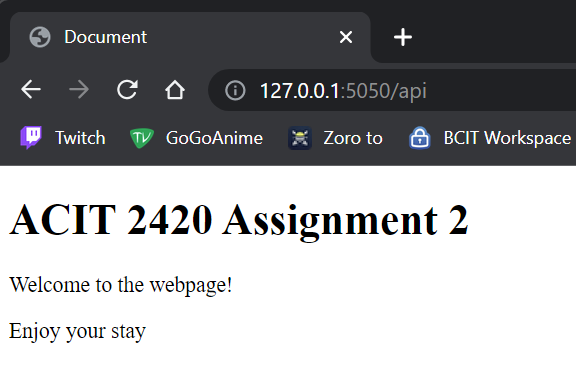

# ACIT 2420 Assignment 2

## Table of Contents

- [VPC Setup](#vpc-setup)
- [Creating Droplets](#creating-droplets)
- [Load Balancer Setup](#load-balancer-setup)
- [Firewall Setup](#firewall-setup)
- [Create User](#create-user)
- [Installing Caddy](#installing-caddy)
- [Writing the Web App](#writing-the-web-app)
- [Installing Volta](#installing-volta)
- [Installing Node](#installing-node)
- [Getting Started with Node](#getting-started-with-node)

## VPC Setup

1. On DigitalOcean, click on "Networking" then "VPC" then "Create VPC Network".

2. Set the preferred data centre.

3. Set the IP range to be generated by DigitalOcean.

4. Set the name of the VPC to something you can remember.

5. If the VPC was created successfully, you should be able to see the VPC under the "VPC" tab after clicking on "Networking".


## Creating Droplets

- Note: Before beginning, you will need to have a custom SSH key generated and added to DigitalOcean.

1. Create a new Droplet on DigitalOcean

- Note: All the settings will be set to default if not specified in the instructions below.

2. Set the VPC network to the VPC network you had just created.


3. CPU option can be set to anything. I will be using the cheapest option.

4. Set the SSH key a key that is added to DigitalOcean.

5. Set the number of droplets to 2.

6. Set the name of one droplet to "server-one".

7. Set the name of the other droplet to "server-two".

8. Add the tag "Web".

9. Click on "Create Droplet".

If done successfully, 2 droplets should have been generated with the tag "Web" and its names set to "server-one" and "server-two"


## Load Balancer Setup

1. Click on "Networking" then "Create Load Balancer" then "Create Load Balancer"

- Note: All the settings will be set to default if not specified in the instructions below.

2. Select the region that the droplets have been created in.

3. Change the VPC network to the VPC network that you had created in the VPC Setup instructions.

4. Under "Connect Droplets" type in "Web".

- **Note:** Once you have entered "Web", it should display that there is 2 droplets similar to the image below.



5. Under "Forwarding Rules", make sure that the settings match the image below.


6. The name of the load balancer can be set to anything. I will be keeping it as the default name.

7. Click on "Create Load Balancer".

If done successfully, you should be able to view the load balancer under "Load Balancers" in "Networking". Your screen should display something similar to the image below.

- Note: The status for both the load balancer and the droplets will be set to "down".



8. Verify that the droplets that you created are also displayed once clicking on the load balancer.


## Firewall Setup

1. Click on "Networking" then "Firewalls" then "Create Firewall".

- Note: All the settings will be set to default if not specified in the instructions below.

2. Set the name of the firewall to your preference.

3. Under "Inbound Rules", click on the dropdown for "New Rule" and select HTTP.

4. For the source of the new rule, add the load balancer that you had created. The settings for "Inboud Rules" should be similar to the image below.


5. Under "Apply to Droplets", add the tag "Web".

6. Click "Create Firewall"

7. Verify that the firewall now exists under "Firewalls" in "Networking".


8. Verify that the 2 droplets created previously are also under "Droplets" after clicking on the name of the firewall.


## Create User

- Note: Follow the following steps in server-one and server-two. I will also be setting the username for both servers to be the same.

1. SSH into server-one by using the `ssh -i ~/.ssh/DO_server_key root@137.184.116.80`.

- Note: Reminder that the server key filename will be different and the IP address will be different.

2. Add a new user by using the `useradd -ms /bin/bash sora`.

- Note: The username can be set to you preference.

3. Set the password for the new user by using the `passwd sora` command.

4. Copy the ssh file to the new user's gome directory by using the following command:

	```
	rsync --archive --chown=sora:sora ~/.ssh /home/sora`
	```


5. Verify that the new user's home directory exists in the `/home` directory and the `.ssh` directory exists inside the user's home directory.


6. SSH into the new user by using the `ssh -i ~/.ssh/DO_server_key sora@137.184.116.80` command.

7. Open the `sshd_config` file by using the `sudo vim /etc/ssh/sshd_config` command.

8. Change the "PermitRootLogin yes" to "PermitRootLogin no" then save the file.


9. Use the `sudo systemctl restart ssh` command to apply the ssh config.

- Note: If done correctly, you should not be able to SSH into the root user from your local terminal.

10. Check if there are any updates to be installed by using the `sudo apt update` command. If there is, follow to step 11. If not Continue to Installing Caddy.

11. To install the updates, use the `sudo apt upgrade` command.

You have successfully created a new user and installed the latest updates.

## Installing Caddy

- Note: The following steps must be done in both droplets.

1. Download the .tar.gz file for Caddy by running the command below.

- Note: This file cna be installed anywhere in the user's home directory. We will be moving the file to a different directory later.

	```
	wget https://github.com/caddyserver/caddy/releases/download/v2.6.2/caddy_2.6.2_linux_amd64.tar.gz
	```

- Note: The output should look something similar to the image below.


2. Unarchive the downloaded file by using the command below.

	```
	tar xvf caddy_2.6.2_linux_amd64.tar.gz
	```

- Note: The output of the command should look similar to the image below. And the file should be an executable file.


3. Change the ownership of the file to root by using the `sudo chown root: caddy` command.

4. Verify that the ownership change was done so successfully.


5. Copy the `caddy` file to the `/usr/bin/` directory by using `sudo cp caddy /usr/bin/` command.

6. Verify that the file exists in the `/usr/bin/` directory.

You have successfully installed the Caddy web server.

## Writing the Web App

- Note: All of the steps below will be completed in the local terminal. DO NOT use server-one and server-two.

1. Create the main directory in using the `mkdir 2420-assign-two`. The folder name does not have to match.

2. Inside the directory we just created, create two more directories by using the `mkdir /2420-assign-two/src/ && mkdir /2420-assign-two/html/` command.

3. Inside the html directory, use the `vim index.html` command to create and edit the index.html file.

4. Add the following contents to the index.html file.

- Note: The contents between the two body tags can be altered to your preference.

	```
	<!DOCTYPE html>
	<html lang="en">
	<head>
    		<meta charset="UTF-8">
    		<meta http-equiv="X-UA-Compatible" content="IE=edge">
    		<meta name="viewport" content="width=device-width, initial-scale=1.0">
    		<title>Document</title>
	</head>
	<body>
    		<h1>ACIT 2420 Assignment 2</h1>
    		<p>Welcome to the webpage!</p>
    		<p>Enjoy your stay</p>
	</body>
	</html>
	```

## Installing Volta

1. Run the command, `curl https://get.volta.sh | bash` to begin installing Volta.


## Installing Node

1. Run the command, `volta install node` to being installing node.


## Getting Started with Node

1. Inside the src directory, create a new node project by running the `npm init` command.

- Note: When prompted for anything, you can just press the Enter key. The command output should look similar to the image below.


2. Install the fastify module by running the `npm i fastify` in the src directory.

- Note: If the installation was successful, then there should be 0 vulnerabilities returned in the output as shown in the image below.


3. Inside the src directory, use the `vim index.js` command to create and edit the index.js file.

4. Add the following contents to the index.js file.

	```
	// Require the framework and instantiate it
	const fastify = require('fastify')({ logger: true })
	const fs = require("fs")

	// Declare a route
	fastify.get('/api', async (request, reply) => {
        	const readStream = fs.createReadStream('../html/index.html')
        	await reply.type('text/html').send(readStream)
	})

	// Run the server!
	const start = async () => {
        	try {
                	await fastify.listen(5050)
        	} catch (err) {
                	fastify.log.error(err)
                	process.exit(1)
        	}
	}
	start()
	```

5. Verify that you have setup correctly by running the command, `node index.js`. You output should be similar to the image below.


6. In a browser, type in the http link that was returned in the output. In my case it would be `http://127.0.0.1:5050`.

- **Note:** This will display an error since we did not configure a route for "/", but if we typed in `http://127.0.0.1:5050/api` the webpage should display a webpage similar to the image below.



---

## Copying Files

- Note: Both the html and src directories must be copied to server-one and server-two.

1. Create the directory, `www` in the `/var` directory by using the command, `sudo mkdir www`.

2. Run the command, `rsync -aPv -e "ssh -i ~/.ssh/DO_server_key" ./src ./html sora@64.227.110.206:~` to save the src and html directory in the home directory of the user.

3. Verify that both html and src directories exist in the ome directories for both server-one and server-two.

4. Move both directories to `/var/www` by using the `sudo mv ./src ./html -t /var/www` command.

5. Verify that the contents have been moved to the correct directory. Also note that the ownership of the directories is your username and not the root user.


- **Important Note:** You must complete the node setup procedures in the `/var/www/src` directory. You must also run the `source ~/.bashrc` command in order to apply the changes made.

---

## Creating the CaddyFile

- Create the Caddyfile in your local terminal. We will be moving the files over to server-one and server-two later.

1. To create and edit the Caddyfile, use the `vim Caddyfile` command.

- Note: The 'C' MUST be capitalized.

2. Add the following contents to the Caddyfile.

	```
	http://143.244.211.3 {
        	root * /var/www
        	reverse_proxy /api localhost:5050
        	file_server
	}
	```

3. Move the Caddyfile to the server-one and server-two using the `rsync` command from before.

## Creating the Service Files

- Create the service file in you local terminal. We will be moving the files over to server-one and server-two later.

1. To create and edit the service file, use the `vim hello_web.service` command.

2. Add the following contents to the service file.

	```
	[Unit]
	Description=Service file to run the node application
	After=network.target

	[Service]
	Type=simple
	User=sora
	ExecStart=/home/sora/.volta/bin/node /var/www/src/index.js
	Restart=on-failure

	[Install]
	WantedBy=multi-user.target
	```

3. Create another service file with the filename "caddy.service" by using the `vim caddy.service` command.

4. Add te following contents to the caddy.service file.

	```
	[Unit]
	Description=Serve HTML in /var/www using caddy
	After=network.target
	
	[Service]
	Type=notify
	ExecStart=/usr/bin/caddy run --config /etc/caddy/Caddyfile
	ExecReload=/usr/bin/caddy reload --config /etc/caddy/Caddyfile
	TimeoutStopSec=5
	KillMode=mixed

	[Install]
	WantedBy=multi-user.target
	```

5. Move both service files to both server-one and server-two by using the `rsync` command from before.


